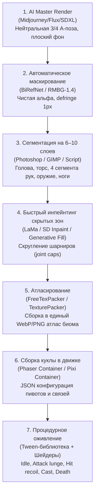

# 2D Asset Pipeline Research: AI-Generated Fantasy Characters to Game-Ready Animated 2D Assets

Актуализировано: 17 сентября 2026.  
Статус: **RECOMMENDATION V0.1 / FOR REVIEW** (не является утверждённым production-решением; финальный выбор остаётся за пользователем).  
Контекст проекта: **Arrow-Roguelite** (браузерная игра, целевая платформа — VK Games / VK Mini Apps, мобильные и десктопные браузеры, WebGL/Canvas).

---

## 1. Резюме исследования

Цель исследования — определить практичный, масштабируемый и оптимизированный по ресурсам пайплайн:  
`AI-generated fantasy character -> game-ready animated 2D asset for browser/VK`.

### Главные выводы

1. **Ответ на ключевой вопрос**:  
   **ДА, практически возможно взять ОДИН качественный AI-рендер персонажа, разрезать его на 6–12 слоёв и получить убедительную, сочную игровую анимацию.**  
   Более того, для условий *Arrow-Roguelite* (враги стоят по периферии вокруг центрального board, смотрят внутрь арены и никогда не совершают полных 3D-разворотов на 180°) этот подход является **наиболее эффективным по качеству, расходу памяти и контролю стиля**.
2. **Сравнение 5 подходов**:
   - **Покадровые спрайтшиты от AI** и **видео-генерация (Runway/Kling) с нарезкой кадров** — **НЕПРИГОДНЫ** для продакшена на VK Games. Они создают катастрофический расход видеопамяти (VRAM) на мобильных устройствах (до 400–1400 МБ на 30–100 врагов), страдают от мерцания контуров (temporal boiling) и дают грязную альфу.
   - **AI Pose Sheet (покадровые позы)** — требует слишком много ручной дорисовки и ретуши между позами из-за дрейфа деталей костюма (prompt/latent drift).
   - **One Master Render + Layered Puppet** и **Hybrid Layered PNG + Procedural FX** — **ЕДИНСТВЕННЫЕ жизнеспособные варианты** для мобильного WebGL/Canvas с жестким лимитом памяти и требованием 60 FPS.
3. **Рекомендованный V0.1 пайплайн**:  
   **Hybrid Layered Puppet (6–10 слоёв) + процедурные твины движения + шейдерный/частичный VFX (squash/stretch, hit flash, trails, dissolve)**.  
   Расход VRAM: **~1 МБ на врага** (или ~0.4 МБ при плотной упаковке атласа). 100 врагов в игре занимают суммарно всего **30–40 МБ VRAM** вместо 900+ МБ у покадровых спрайтов.

---

## 2. Разбор ключевого вопроса: можно ли оживить ОДИН AI-рендер нарезкой на 6–12 частей?

### 2.1. Вердикт: ДА, но при строгих правилах генерации

Этот метод проверен в индустрии такими играми, как *Darkest Dungeon*, *Slay the Spire*, *AFK Arena*, *Hero Wars*, *Fluffy Fall*. Все они используют плоские 2D-куклы (cut-out/puppet), созданные из единого арта.

Для нашего проекта специфика делает этот подход ещё более выигрышным:
- **Фиксированный ракурс**: враги находятся на внешней арене по сторонам от board (сверху, снизу, слева, справа) и всегда ориентированы лицом к центру игрового поля.
- **Отсутствие нужды в перемещении по глубине и 3D-разворотах**: врагу не нужно бежать вдаль или поворачиваться спиной к камере.
- **Роль врага в Arrow-Roguelite**: враг выполняет телеграфы (накапливает таймер/атаку), кастует заклинания/снаряды, вздрагивает при попадании стрелы (hit recoil) и зрелищно умирает (death dissolve). Все эти фазы идеально ложатся на кукольную анимацию со смещением частей, наклонами и масштабированием.

### 2.2. Требования к исходному мастер-рендеру (Master Render Rules)

Нельзя взять *любой* случайный арт. Арт должен генерироваться под нарезку:

| Параметр | Требование | Почему это критично |
|---|---|---|
| **Поза** | Нейтральная полуфронтальная (3/4 semi-frontal) или «A-pose» | Конечности не должны закрывать тело. Если рука с мечом прижата к груди, вырезать её без чудовищной дыры на доспехе невозможно. |
| **Оружие/предметы** | Оружие держится в вытянутой или слегка отведенной руке | Позволяет вырезать оружие в отдельный спрайт для последующего вращения или смены скинов. |
| **Освещение** | Диффузное, мягкое, без жестких косых теней на теле | Если на животе лежит контрастная тень от руки, то при поднятии руки на анимации атаки эта тень останется «нарисованной» на животе. |
| **Фон** | Сплошной нейтральный (серый `#808080` или зеленый `#00FF00` chroma) | Обеспечивает идеальное маскирование без паразитной каймы. |
| **Контур** | Четкий силуэт, отсутствие полупрозрачных волосков/дыма на базовом теле | Дым и свечение добавляются процедурно в движке, а не запекаются в персонажа. |

### 2.3. Анатомическая декомпозиция (6–12 слоёв)

Оптимальное разделение персонажа для врага в *Arrow-Roguelite*:

```text
Root
 ├── Pelvis / Hips (базовый якорь)
 │    ├── Torso / Chest (грудь, дышит/наклоняется)
 │    │    ├── Neck / Head (голова, качается/моргает)
 │    │    ├── Left Upper Arm (плечо дальнее)
 │    │    │    └── Left Forearm + Hand (предплечье дальнее)
 │    │    └── Right Upper Arm (плечо ближнее)
 │    │         └── Right Forearm + Hand (предплечье ближнее)
 │    │              └── Weapon (клинок / посох / щит)
 │    ├── Left Thigh (бедро дальнее)
 │    │    └── Left Shin + Foot (голень дальняя)
 │    └── Right Thigh (бедро ближнее)
 │         └── Right Shin + Foot (голень ближняя)
 └── Secondary (плащ / хвост / рога / челюсть) — опционально
```

- **Минимальный набор (6 частей)**:
  1. Голова
  2. Торс + бедра
  3. Ближняя рука с оружием
  4. Дальняя рука
  5. Ноги (статичная опора)
  6. Вторичный элемент (плащ/хвост/щит)
- **Стандартный набор (8–10 частей)**:
  Голова, торс, таз, рука ближняя (2 сегмента), рука дальняя (2 сегмента), ноги (2–4 сегмента), оружие.

### 2.4. Решение проблемы скрытых зон (Occlusion) и разрыва суставов

При разрезании плоского арта возникают две проблемы:
1. **Дыра под перекрытием**: когда ближняя рука поднимается, за ней обнажается часть груди или ремня, которой не было на исходной картинке.
2. **Разрыв сустава (Joint Gap)**: при повороте предплечья в локте на 20° прямой срез текстуры обнажает пустоту между деталями.

**Решение в пайплайне:**
- **Округлые шапки суставов (Rounded Joint Caps)**: при нарезке конечностей концы в местах сгиба (плечо, локоть, колено) делаются выпуклыми полуокружностями («шаровые шарниры»), уходящими под родительский слой.
- **AI Inpainting для скрытых зон**:
  - Быстрый полуавтоматический инпейнтинг (через Photoshop Generative Fill, Stable Diffusion Inpaint или open-source LaMa / BiRefNet).
  - На скрытую зону за рукой требуется всего 5–15 секунд автоматического инпейнта, так как там нужна лишь фоновая текстура доспеха/кожи, которую никто не будет разглядывать в упор на мобильном экране.
- **Иерархический Z-Order**: правильный порядок отрисовки слоев (Back Arm -> Back Leg -> Torso/Pelvis -> Head -> Front Leg -> Front Arm -> Weapon) скрывает 80% артефактов сочленений.

### 2.5. Кинематические ограничения: что работает отлично, а что нет

- **Что работает на 10/10**:
  - *Idle*: микро-покачивание таза, дыхание груди (масштабирование по Y на 2–3%), покачивание оружия и головы, трепетание плаща/хвоста.
  - *Telegraph / Замах*: отведение руки назад, наклон корпуса, подъем оружия.
  - *Hit Reaction*: мгновенный сдвиг назад (-10px), наклон назад на 8°, сплющивание (squash), мигание белым силуэтом. Выглядит потрясающе кинетично.
  - *Cast / Charge*: подъем рук вверх, зависание над землей, вибрация корпуса от магической энергии.
  - *Death*: падение на колени + растворение/разлет на частицы/погружение в землю.
- **Что НЕ работает (табу для 2D-кукол)**:
  - Разворот корпуса на 90–180 градусов.
  - Длинный круговой взмах мечом с выходом в третью плоскость (выглядит как вращение бумажной картонки).
  - *Как это компенсируется в Arrow-Roguelite*: атака ближнего боя для моба на краю поля — это **быстрый бросок (lunge) всего контейнера персонажа в сторону board** с резким возвратом + процедурный след удара (slash VFX). Это стандарт лучших мобильных экшен-баттлеров.

---

## 3. Сравнительный анализ 5 исследуемых подходов

Ниже приведен детальный анализ каждого из пяти вариантов применительно к стеку WebGL/Canvas и платформе VK Games.

```
+---------------------------------------------------------------------------------------------------+
| ВАРИАНТ 1: One Master Render + Layered Puppet (Скелетно-кукольный 2D)                              |
+---------------------------------------------------------------------------------------------------+
| Консистентность:     10/10 — Идеальная. Персонаж выглядит ровно так, как его сгенерировал AI.    |
| Ручная работа:       Средняя (15–30 мин на персонажа при автоматизированном тулинге).            |
| Прозрачный фон:      Идеальный (вырезается один раз нейросетью BiRefNet/RMBG с defringing).        |
| Скрытые части:       Требуется быстрое дорисовывание/инпейнтинг суставов и зон перекрытия.        |
| Pivot Points:        Задаются один раз на слой в JSON или TexturePacker.                          |
| Состояния:           Idle (отл), Cast (отл), Hit (отл), Attack (хор через твин/VFX), Death (хор). |
| Размер файлов:       Минимальный: ~100–250 КБ (WebP) на персонажа.                                |
| VRAM на врага:       ~1.0 МБ (512x512) или ~0.25 МБ (при упаковке 4 врагов в 1024x1024).         |
| 10 / 30 / 100 мобов: 10 МБ / 30 МБ / 100 МБ VRAM (полностью безопасно для мобилок).               |
| Батчинг/GPU:         Максимальный (1 draw call на весь пак мобов из общего атласа).              |
| Совместимость:       Phaser 3/4, Pixi.js, Canvas 2D (нативная трансформация контейнеров).          |
+---------------------------------------------------------------------------------------------------+
```

```
+---------------------------------------------------------------------------------------------------+
| ВАРИАНТ 2: Generated Pose Sheet (Генерация ключевых кадров AI)                                    |
+---------------------------------------------------------------------------------------------------+
| Принцип: AI генерирует 4-6 статических картинок одного героя в разных позах (Idle, Cast, Hit...).  |
| Консистентность:     4/10 — Низкая. Даже с ControlNet/IP-Adapter «плывут» пряжки, узоры, лицо.    |
| Ручная работа:       Очень высокая (1–3 часа на персонажа для зачистки нестыковок и артефактов).  |
| Прозрачный фон:      Трудоемкий: нужно вырезать и чистить каждый кадр отдельно.                   |
| Скрытые части:       Не требуются (кадр генерируется целиком).                                    |
| Pivot Points:        Требуется ручное выравнивание центра масс для каждого кадра, иначе дергается|
| Состояния:           Дискретная смена поз (слайд-шоу), не хватает плавности без твинов.          |
| Размер файлов:       Средний (~500–900 КБ WebP на персонажа).                                     |
| VRAM на врага:       ~4–8 МБ VRAM.                                                                |
| 10 / 30 / 100 мобов: 40–80 МБ / 120–240 МБ / 400–800 МБ VRAM (на 100 врагов риск OOM на VK).     |
| Батчинг/GPU:         Хороший при упаковке в общий атлас, но атласы быстро разрастаются.          |
| Совместимость:       Phaser/Pixi/Canvas — полная.                                                 |
+---------------------------------------------------------------------------------------------------+
```

```
+---------------------------------------------------------------------------------------------------+
| ВАРИАНТ 3: Generated Spritesheet (Покадровая генерация 2D-спрайтшитов)                            |
+---------------------------------------------------------------------------------------------------+
| Принцип: Прямой промптинг моделей вида «pixel art spritesheet» или grid-генераторы.                |
| Консистентность:     2/10 — Катастрофический «кипящий контур» (boiling), изменение анатомии.      |
| Ручная работа:       Экстремальная (проще нарисовать вручную, чем чистить 30 кадров AI-каши).     |
| Прозрачный фон:      Ужасный (грязные пиксели на стыках сетки, ореолы).                           |
| Скрытые части:       Не применимо.                                                                |
| Pivot Points:        Смещение персонажа в ячейках, постоянный джиттер на экране.                  |
| Состояния:           Формально есть, визуально — неряшливо и непрофессионально.                   |
| Размер файлов:       Большой (1.5–3 МБ на персонажа).                                             |
| VRAM на врага:       ~9.5–36 МБ VRAM на персонажа.                                                |
| 10 / 30 / 100 мобов: 95 МБ / 280 МБ / 950 МБ VRAM (гарантированный краш мобильного браузера).    |
| Батчинг/GPU:         Плохой: огромные текстуры вызывают частый swap текстур.                     |
| Вердикт:             ПОЛНОСТЬЮ НЕПРИГОДНО для коммерческого продакшена.                           |
+---------------------------------------------------------------------------------------------------+
```

```
+---------------------------------------------------------------------------------------------------+
| ВАРИАНТ 4: Short AI Video -> Frame Extraction (Runway / Kling / Luma / AnimateDiff)               |
+---------------------------------------------------------------------------------------------------+
| Принцип: AI анимирует статичный мастер-рендер в видео (2 сек) -> нарезка 24-30 fps -> удаление фона|
| Консистентность:     5/10 — Детали персонажа сохраняются в целом, но контуры «дышат» и деформируются|
| Ручная работа:       Высокая: пакетное маскирование видео (RMBG-Video), удаление артефактов фона.  |
| Прозрачный фон:      Проблемный: motion blur видео сливает пиксели персонажа с фоном (green spill).|
| Скрытые части:       Не применимо.                                                                |
| Pivot Points:        Требуется программная стабилизация (video stabilization anchor).              |
| Состояния:           Сложно генерировать точный Hit/Cast (видеомодели плохо контролируются по таймингам).|
| Размер файлов:       Огромный (30–60 кадров = 2–5 МБ WebP).                                       |
| VRAM на врага:       ~15–40 МБ VRAM.                                                              |
| 10 / 30 / 100 мобов: 150 МБ / 450 МБ / 1.5 ГБ VRAM (мгновенный WebGL Context Lost на смартфонах).|
| Батчинг/GPU:         Низкий, огромный оверхед на декодирование и загрузку текстур.                |
| Вердикт:             Подходит только для 1-2 сюжетных синематиков/интро, НЕ для игровых врагов.   |
+---------------------------------------------------------------------------------------------------+
```

```
+---------------------------------------------------------------------------------------------------+
| ВАРИАНТ 5: Hybrid Layered PNG + Procedural FX (Минимальные слои + процедурный сок)                |
+---------------------------------------------------------------------------------------------------+
| Принцип: Персонаж делится всего на 2-4 слоя (Тело, Оружие, Спецэффект) + мощный процедурный движок |
|          (твины squash/stretch, шейдер белой вспышки, частицы, следы от снарядов).                |
| Консистентность:     10/10 — Идеальная. Нулевой визуальный дрейф.                                 |
| Ручная работа:       Минимальная (5–10 мин на персонажа).                                         |
| Прозрачный фон:      Идеальный, вырезается одной операцией.                                       |
| Скрытые части:       Почти отсутствуют, так как деление минимально.                               |
| Pivot Points:        Базовый центр в ногах + точка крепления оружия.                              |
| Состояния:           Все состояния решаются математикой движка и шейдерами:                       |
|                      - Idle: scale sine wave + дыхание;                                           |
|                      - Attack: рывок вперед + trail + weapon slash VFX;                           |
|                      - Hit: red/white tint + recoil knockback + sparks;                           |
|                      - Cast: левитация + aura particles + charging rune;                          |
|                      - Death: dissolve shader / particle poof / sink into ground.                 |
| Размер файлов:       Ультра-компактный: ~50–120 КБ WebP на персонажа.                             |
| VRAM на врага:       ~0.5–1.0 МБ VRAM.                                                            |
| 10 / 30 / 100 мобов: 5 МБ / 15 МБ / 50 МБ VRAM (максимально лёгкий профиль из всех возможных).   |
| Батчинг/GPU:         Экстремальная производительность, 60 FPS на любом слабом смартфоне.          |
| Совместимость:       Идеальная с Phaser 3/4, Pixi.js, Canvas 2D.                                  |
+---------------------------------------------------------------------------------------------------+
```

### Сводная матрица сравнения

| Критерий | 1. Layered Puppet (6-12) | 2. Pose Sheet | 3. Spritesheet | 4. AI Video -> Frames | 5. Hybrid (3-4 слоя + FX) |
|---|---|---|---|---|---|
| **Визуальная консистентность** | **10 / 10** | 4 / 10 | 2 / 10 | 5 / 10 | **10 / 10** |
| **Затраты ручного труда** | 20–30 мин | 1–3 часа | Экстремально | 1–2 часа | **5–10 мин** |
| **Качество альфа-канала** | **Идеальное** | Хорошее | Грязное | Проблемное | **Идеальное** |
| **Управление таймингами боя** | **Кадрово-точное** | Дискретное | Жесткое | Неуправляемое | **Кадрово-точное** |
| **Размер файлов (диск/сеть)** | **100–250 КБ** | 500–900 КБ | 1.5–3 МБ | 2–5 МБ | **50–120 КБ** |
| **VRAM на 1 врага** | **~1 МБ** | ~4–8 МБ | ~10–25 МБ | ~15–40 МБ | **~0.5–1 МБ** |
| **VRAM на 30 врагов** | **~30 МБ** | ~180 МБ | ~450 МБ (OOM!) | ~600 МБ (OOM!) | **~15 МБ** |
| **VRAM на 100 врагов** | **~100 МБ** | ~600 МБ (КРАШ) | ~1.5 ГБ (КРАШ) | ~2.5 ГБ (КРАШ) | **~50 МБ** |
| **Батчинг (Draw calls)** | 1 на атлас | 1 на атлас | Частый swap | Частый swap | 1 на атлас |
| **Вердикт для VK Games** | **РЕКОМЕНДОВАНО** | Нежелательно | **БРАК** | **НЕПРИГОДНО** | **РЕКОМЕНДОВАНО** |

---

## 4. Математика видеопамяти (VRAM), атласы и производительность браузера

### 4.1. Главный закон текстурной памяти WebGL

> **Важно помнить**: сжатие PNG или WebP снижает размер файла на диске и ускоряет скачивание по сети, но **НЕ УМЕНЬШАЕТ расход оперативной и видеопамяти GPU**.

Когда браузер распаковывает изображение в текстуру WebGL, оно переводится в несжатый массив пикселей:
$$\text{VRAM (байты)} = \text{Ширина (px)} \times \text{Высота (px)} \times 4 \text{ байта (для формата RGBA8888)}$$

*Пример*:
- Файл `goblin.webp` может весить на диске **120 КБ**.
- Но если его текстурный атлас имеет размер $1024 \times 1024$, в видеопамяти он займет:
  $$1024 \times 1024 \times 4 = 4\,194\,304 \text{ байта} = \mathbf{4.0\text{ МБ VRAM}}.$$
- Атлас $2048 \times 2048$ занимает ровно **16.0 МБ VRAM**.

> *Примечание о сжатых форматах GPU (ASTC, ETC2, KTX2/Basis)*:  
> В вебе/VK использование ASTC/ETC2 фрагментировано (разные форматы для iOS и Android, браузеры Safari/Chrome требуют сложного WebAssembly-транскодера Basis Universal, увеличивающего размер стартового бандла). Для 2D-веб-игр стандартом де-факто остается RGBA8888 / RGBA4444 с оптимизацией геометрии атласов.

### 4.2. Расчет памяти для 10 / 30 / 100 врагов

Предположим реалистичный набор анимаций для покадрового спрайтшита:
- Idle: 8 кадров
- Telegraph / Attack: 8 кадров
- Hit: 4 кадра
- Cast: 8 кадров
- Death: 8 кадров
- **Итого**: 36 кадров на одного врага.

Сравним покадровый спрайтшит против модульной 2D-куклы:

| Конфигурация | Размер 1 кадра/части | Суммарная площадь текстур на 1 врага | VRAM на 1 врага | **10 врагов** | **30 врагов** | **100 врагов** |
|---|---|---|---|---|---|---|
| **Покадровый AI (256x256)** | 256x256 px | 36 кадров $\approx 1536 \times 1536$ | **9.4 МБ** | 94 МБ | **282 МБ** *(Предел iOS)* | **940 МБ** *(Фатальный краш)* |
| **Покадровый AI (512x512)** | 512x512 px | 36 кадров $\approx 3072 \times 3072$ | **37.7 МБ** | 377 МБ | **1.13 ГБ** *(Краш)* | **3.77 ГБ** *(Мгновенный краш)* |
| **Layered Puppet (512x512 атлас)** | 6-10 запчастей | 1 атлас $512 \times 512$ | **1.0 МБ** | **10 МБ** | **30 МБ** | **100 МБ** *(Стабильно)* |
| **Layered Puppet (1024x1024 общий)** | 4 врага в 1 атласе | $0.25$ от атласа $1024 \times 1024$ | **1.0 МБ** | **10 МБ** | **30 МБ** | **100 МБ** *(Стабильно)* |
| **Hybrid Minimal (3-4 части)** | Обрезка пустоты | $\approx 350 \times 350$ эффективная | **0.49 МБ** | **4.9 МБ** | **14.7 МБ** | **49 МБ** *(Легковесно)* |

### 4.3. Лимиты мобильных браузеров и VK WebView

На основе бенчмарков мобильных платформ VK:
1. **iOS Safari / WKWebView (iPhone)**:
   - Лимит памяти на одну вкладку браузера составляет **384–512 МБ суммарно** (включая DOM, JS Heap и WebGL ресурсы).
   - При превышении этого порога вкладка без предупреждения перезагружается («Произошла ошибка с веб-страницей»).
   - Покадровые спрайты на 30 врагов (282 МБ VRAM + JS-память движка) гарантированно вызывают аварийную перезагрузку на устройствах iPhone 8 — iPhone 12.
2. **Android Webview (бюджетные устройства 2–3 ГБ RAM, Adreno 506 / Mali-G52)**:
   - При расходе WebGL VRAM свыше **150–200 МБ** операционная система форсированно сбрасывает WebGL-контекст (`webglcontextlost`), экран становится черным, и игра зависает.
3. **Вывод по памяти**:  
   **Единственный способ поддерживать 30–100 уникальных врагов в рогалике на мобильном вебе — это модульные 2D-куклы с динамической подгрузкой атласов по актам/локациям.**

### 4.4. Батчинг (Draw Calls) в Pixi и Phaser

- **Как работает батчинг**: WebGL отправляет видеокарте команду рисования (draw call). Если следующий спрайт на экране использует ту же текстуру (тот же атлас), тот же шейдер и тот же BlendMode, движок объединяет их в один общий буфер геометрии (Quad batching) и рисует за **1 draw call**.
- **Проблема покадровых анимаций**: если на экране 3 разных врага, и у каждого свой огромный спрайтшит $2048 \times 2048$, видеокарта вынуждена непрерывно переключать текстурные слоты (texture thrashing).
- **Победа модульных кукол**:
  - Все детали всех мобов конкретного Акта (например, Гоблин, Слизень, Летучая мышь, Шаман) упаковываются в **один общий атлас $1024 \times 1024$ или $2048 \times 2048$**.
  - Сколько бы мобов и их запчастей ни находилось вокруг арены, движок рендерит их всех **за 1–2 draw calls**!
  - Это гарантирует стабильные **60 FPS** даже на старых смартфонах.

---

## 5. Как закрываются 5 обязательных состояний персонажа

В играх жанра roguelite для врага критически важны 5 состояний: **Idle, Attack, Hit, Cast, Death**.  
Как они реализуются в рекомендованном гибридном пайплайне:

### 1. Idle (Ожидание)
- **Техника**: Процедурный синусоидальный твин (Sine wave oscillation).
- **Движение**:
  - Таз/основание: легкое покачивание вверх-вниз на 2–3 пикселя (`y: += 3, duration: 1200ms, yoyo: true`).
  - Торс: микро-масштабирование по высоте (`scaleY: 1.0 -> 1.03`) — эффект дыхания.
  - Голова: запаздывание за торсом на 100ms.
  - Рука с оружием: покачивание по углу (`angle: ±2-3°`).
- **Текстурный оверхед**: **0 дополнительных кадров**.

### 2. Attack (Атака / Срабатывание таймера)
- **Контекст Arrow-Roguelite**: враги стоят вокруг board. Их атака направлена внутрь, на игрока или игровое поле.
- **Техника**: Фазовая анимация перемещения (Telegraph -> Strike -> Recovery) + процедурный VFX.
- **Движение**:
  1. *Telegraph (подготовка)*: наклон корпуса назад (`angle: -8°`), подъем руки с оружием вверх, шкала угрозы пульсирует.
  2. *Strike (удар)*: резкий рывок вперед к board (`x/y translation: 25px, duration: 80ms, ease: Expo.In`), оружие резко опускается вниз.
  3. *Impact (момент контакта)*: рождение снаряда или появление следа удара (Slash VFX / Projectile Trail), экранный импульс/шейк.
  4. *Recovery (возврат)*: плавное возвращение в исходную позицию (`duration: 300ms, ease: Back.Out`).
- **Текстурный оверхед**: **0 дополнительных кадров**. Оружие и конечности просто смещаются и поворачиваются движком.

### 3. Hit (Реакция на попадание стрелы)
- **Контекст Arrow-Roguelite**: стрелка вылетает из пазла и вонзается во врага. Отклик должен быть мгновенным и смачным (Juice).
- **Техника**: Recoil твин + шейдерный флэш.
- **Движение**:
  - Мгновенный сдвиг персонажа от центра board на 6–10px (импульс отдачи).
  - Сплющивание по оси удара (`squash/stretch: scaleX 1.15, scaleY 0.88, duration: 60ms`).
  - Шейдер белого силуэта (Hit Flash Shader) на 80 миллисекунд.
  - Разлет искр / осколков магии через частицы движка (Particle Emitter).
- **Текстурный оверхед**: **0 дополнительных кадров** (шейдер перекрашивает существующие пиксели на GPU).

### 4. Cast (Каст способности / призыв / бафф)
- **Техника**: Левитация + циклический поворот рук + свечение.
- **Движение**:
  - Персонаж слегка приподнимается над базовой линией (`y: -8px`).
  - Обе руки поднимаются вверх.
  - Вокруг персонажа закручивается процедурный круг рун (VFX-шейдер или аддитивный спрайт).
  - Оружие начинает пульсировать свечением (glow filter / additive tint).
- **Текстурный оверхед**: 1 переиспользуемый на всех магов спрайт рунического круга.

### 5. Death (Смерть)
- **Техника**: Разлет куклы (ragdoll/burst) или шейдер растворения (Dissolve).
- **Движение (Вариант А — Ragdoll burst, комедийно-аркадный)**:
  - Связи между костями разрываются.
  - Голова, оружие, наплечники и торс разлетаются в стороны по физическим параболам с вращением, уменьшаясь в прозрачности.
- **Движение (Вариант Б — Magical Dissolve, классический фэнтези)**:
  - Персонаж замирает, вспыхивает ярким аддитивным цветом (по цвету стихии стрелы: огонь/лед/яд).
  - Шейдер Dissolve сжигает текстуру через шумовую карту (noise texture) снизу вверх, оставляя облачко искр/дыма.
- **Текстурный оверхед**: **0 дополнительных кадров**.

---

## 6. Рекомендованный практический пайплайн V0.1

Ниже описан пошаговый воспроизводимый пайплайн, не требующий ручной анимации сотен кадров и оптимизированный под 1 исследователя/разработчика.



### Шаг 1. Генерация Master Render
- **Модели**: Flux.1-Dev, Midjourney v6 или SDXL.
- **Промпт-структура**:
  `"2D game character sprite, stylized fantasy [goblin warrior with wooden shield and dagger], clean vibrant vector-like digital illustration, neutral semi-frontal A-pose, arms slightly away from body, visible joints, soft studio lighting, isolated on solid flat neutral grey background, full body, mobile game asset style --no perspective distortion, extreme shadows, cropped limbs"`
- **Результат**: 1 изображение высокого разрешения ($1024 \times 1024$ или $2048 \times 2048$).

### Шаг 2. Автоматическое удаление фона (Alpha Matting)
- **Инструменты**: локальная нейросеть `BiRefNet` или `RMBG-1.4` (лучшие open-source решения на 2026 год, на голову превосходящие старый rembg/U2Net).
- **Постобработка альфы**:
  - Эрозия маски (Erosion) на 1 пиксель (убирает светлый паразитный ореол/halo).
  - Премультипликация альфы (Premultiplied Alpha) для предотвращения темных кромок в WebGL.

### Шаг 3. Сегментация на слои и скругление суставов
- Исходник разрезается на 6–10 логических слоев:
  1. `head`
  2. `torso`
  3. `arm_left_upper`, `arm_left_lower`
  4. `arm_right_upper`, `arm_right_lower`
  5. `weapon`
  6. `legs` (или бедра + голени)
  7. `secondary` (плащ, щит, рога)
- **Правило шарнира**: На верхнем конце локтя и плеча кистью или овалом добавляется выпуклый «шарик» диаметром 15–25px, залитый цветом сочленения. При вращении этот шарик прячется в теле родителя, сохраняя целостность руки.

### Шаг 4. Сборка атласа (Atlas Packing)
- **Инструменты**: `free-tex-packer-cli` или `TexturePacker`.
- **Настройки**:
  - Формат: `JSON Hash` (или `Phaser 3 JSON`).
  - Текстура: `WebP` (качество 90%) + запасной fallback `PNG-8 / PNG-32`.
  - Padding: `2px` (предотвращает texture bleeding при билинейной фильтрации на мобилках).
  - Trim transparency: `Включено` (обрезает пустые пиксели вокруг запчастей, экономя до 60% площади атласа).
  - Extrude: `1px`.

### Шаг 5. Конфигурация пивотов и иерархии (JSON Rig)
Для интеграции в Phaser или Pixi создается компактный data-driven JSON-дескриптор:

```json
{
  "id": "goblin_taunter",
  "textureAtlas": "forest_enemies_atlas",
  "root": {
    "pivot": [0.5, 1.0],
    "parts": [
      { "id": "legs", "frame": "goblin_legs", "pivot": [0.5, 0.1], "offset": [0, -30], "zIndex": 1 },
      { "id": "torso", "frame": "goblin_torso", "pivot": [0.5, 0.85], "offset": [0, -55], "zIndex": 2 },
      { "id": "head", "frame": "goblin_head", "pivot": [0.5, 0.9], "offset": [2, -100], "zIndex": 4 },
      { "id": "arm_back", "frame": "goblin_arm_l", "pivot": [0.5, 0.15], "offset": [-25, -85], "zIndex": 0 },
      { "id": "arm_front", "frame": "goblin_arm_r", "pivot": [0.5, 0.15], "offset": [25, -85], "zIndex": 5 },
      { "id": "weapon", "frame": "goblin_dagger", "pivot": [0.2, 0.8], "offset": [40, -70], "zIndex": 6 }
    ]
  }
}
```

### Шаг 6. Рендеринг и анимация в движке (Phaser / Pixi)
- В движке создается `Container` (в Phaser: `this.add.container()`, в Pixi: `new PIXI.Container()`).
- Внутри контейнера создаются спрайты по координатам из JSON.
- Универсальный контроллер анимаций (`PuppetAnimator`) проигрывает стандартные твины:
  - `playIdle()`: синусоидальное покачивание частей.
  - `playTelegraph(duration)`: натяжение назад.
  - `playAttackLunge(targetX, targetY)`: рывок вперед с возвратом.
  - `playHit()`: вспышка шейдера + смещение по X.
  - `playDeath()`: распад / растворение.

---

## 7. Прототип кейса: первый мини-босс Goblin Taunter

В `docs/VISUAL-DIRECTION.md` зафиксирован первый мини-босс — **Гоблин-провокатор (Goblin Taunter)**:
> «Ключевой визуальный gag: гоблин явно дразнит игрока, разворачивается задом / демонстративно показывает задницу, провоцируя попасть туда стрелой...»

### Как это решает пайплайн V0.1:
1. Для Гоблина-провокатора генерируются **два мастер-рендера**:
   - Арт 1: Гоблин спереди/сбоку (боевая поза, наглый взгляд, кинжал).
   - Арт 2: Гоблин сзади (комедийная поза насмешки: руки шлепают по заднице, голова оглядывается через плечо).
2. Оба арта режутся на те же 6–8 частей и упаковываются в **один и тот же атлас**.
3. При смене фазы боя (когда гоблин решает подразнить игрока под механику Rotate) происходит не сложная покадровая интерполяция, а:
   - Быстрый поворот с прыжком на 180° через `scaleX: 1.0 -> 0.0 -> -1.0` (длительность 120ms) + звук насмешки (SFX).
   - Подмена набора текстур на второй набор из того же атласа.
   - Запуск циклических шлепков рукой по филейной части (простой поворот одной руки на `±15°` с высокой частотой).
4. **Результат**: запоминающийся, смешной и карикатурный босс-момент, созданный минимальными средствами без ручной покадровой анимации.

---

## 8. Открытые вопросы и следующие шаги

1. **Выбор формата риггинга**:
   - *Вариант А (Легковесный)*: Собственный компактный JSON-формат (как описан выше). Плюсы: 0 зависимостей, нулевой оверхед, 100% контроль кода, работает в любом движке (Phaser/Pixi/Canvas).
   - *Вариант Б (Spine 2D / DragonBones)*: Использование рантайма Spine или DragonBones. Плюсы: удобный GUI-редактор кривых анимации, мешевая деформация (FFD). Минусы: лицензия Spine ($379+), оверхед рантайма (~100 КБ JS), деформация мешей снижает батчинг на старых телефонах.
   - *Рекомендация для V0.1*: Начать с легкого собственного JSON-контейнера. Переходить на Spine только если художественные требования к деформации монстров резко возрастут.
2. **Spike-проверка**:
   - Провести практический тест на одном мобе (Goblin Taunter или базовый скелет/слизень): сгенерировать мастер-рендер, нарезать, собрать в тестовом Phaser/Pixi окне и оценить визуальный вес и сочность в руках.

---

*Документ подготовлен в рамках исследовательской ветки `analysis/2d-asset-pipeline`. Не является утвержденным production-стандартом до согласования с пользователем.*
