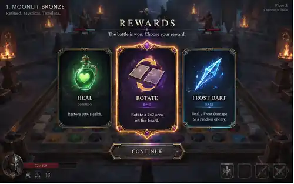
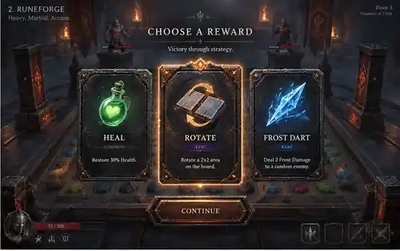
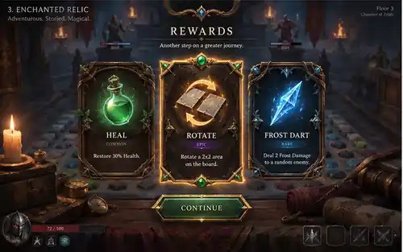
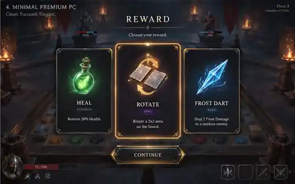

# ART-011 — Reward Choice Screen exploration

Status: visual exploration only. No final style is selected here.

## Canonical reference

Built against `docs/visual-refs/README.md` and the current-game reference set from `docs/visual-refs/current-game/` (reference pack branch `docs/ART-REFS-001-visual-reference-pack`).

The screen keeps the current combat arena visible, only dimmed and de-emphasized. It does not replace the scene, board, HUD language, or game camera.

## Shared UX across all variants

- three large reward cards in the center;
- the battle arena remains readable behind a darkened overlay;
- hovered/selected card is clearly stronger than the other two;
- selection uses a warm amber/gold focus treatment consistent with the current game;
- confirmation action sits directly below the cards;
- reward art is the main focal point; rarity and description stay secondary;
- the layout is desktop-first and keeps the lower HUD visually present but inactive.

## Variants

### 1. Moonlit Bronze

**Pros:** refined and magical; selected-card state is very obvious; preserves the blue/amber combat palette well.  
**Trade-off:** slightly more ornamental than the simplest PC direction.

### 2. Runeforge

**Pros:** strong click targets, clear hierarchy, heavy fantasy/forge identity.  
**Trade-off:** can feel a little too massive and martial for frequent reward screens.

### 3. Enchanted Relic

**Pros:** strongest sense of adventure and item rarity; memorable framed cards.  
**Trade-off:** most decorative option; frame detail competes with reward art sooner.

### 4. Minimal Premium PC

**Pros:** cleanest composition; easiest to scan; least disruptive to the arena; closest to a simple-but-premium desktop UI.  
**Trade-off:** needs animation/VFX at runtime to make reward moments feel as celebratory as the richer variants.

## Interaction note

Suggested behavior for a later implementation pass:
- hover: card lifts/scales slightly and gains a soft amber edge;
- selected: persistent stronger amber frame/glow plus a compact rarity accent;
- non-selected cards remain fully legible, not heavily blurred;
- confirm button becomes the only primary CTA after selection.

No implementation decision is implied by this exploration. Final visual direction remains a user choice.
